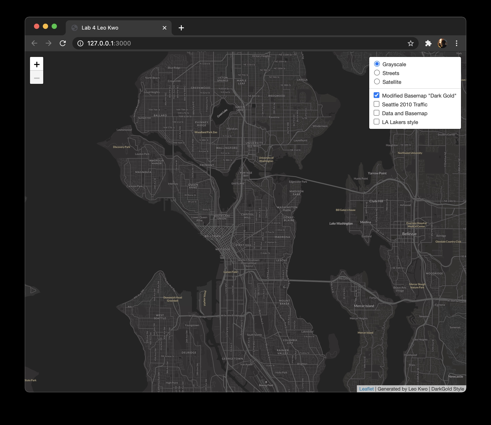
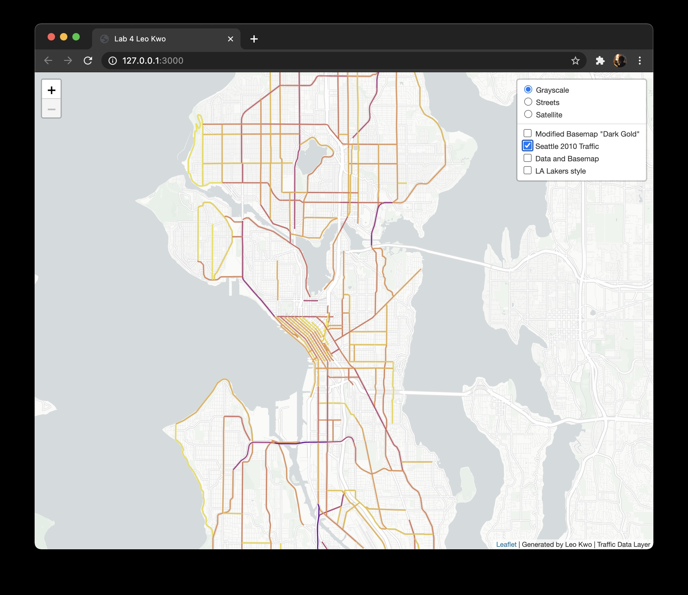
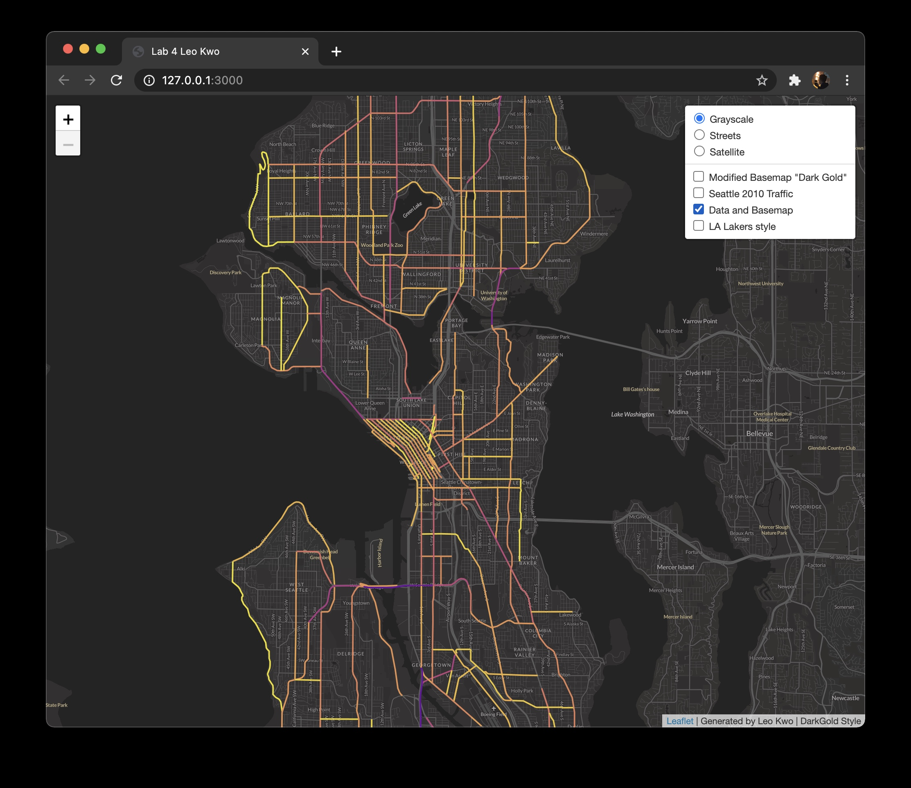
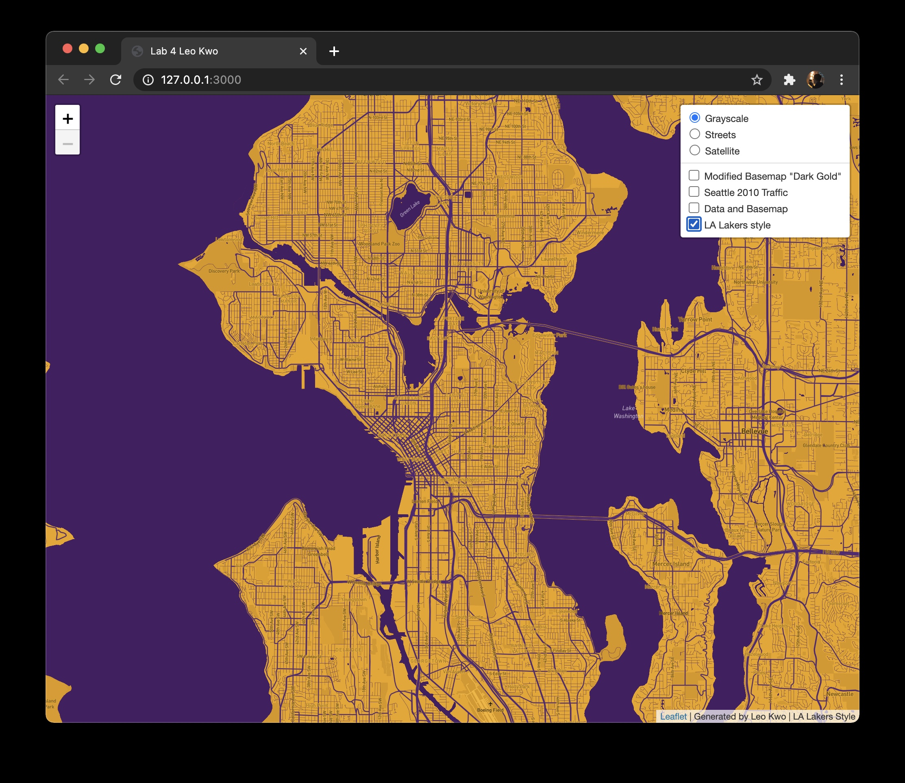

# Lab 4
**Leo Kwo**
**Feb 18, 2020**
**GEOG 458**

Link to the web map: https://leokwo.github.io/geog458lab4_leokwo/
## Screenshots of Maps

- Description: This map is derived from the monochrome dark basemap provided by Mapbox. It has just a tiny amount of gold hint to it. I have changed the font to the Lato family. I have also slightly tweaked some of the color choices. The overall goal is make the basemap more interesting while staying relatively muted.
- Zoom levels: minimum zoom: 12; maximum zoom: 13
- Geographical Area: Seattle City

- Description: This map's data was generated from this [data source](https://data-seattlecitygis.opendata.arcgis.com/datasets/2010-traffic-flow-counts). I downloaded the data as a geojson file. Rendered the data in Mapbox and created a style from tileset.
- Zoom levels: minimum zoom: 12; maximum zoom: 13
- Geographical Area: Seattle City

- Description: This map is created by combining the modified basemap and the data layer.
- Zoom levels: minimum zoom: 12; maximum zoom: 13
- Geographical Area: Seattle City

- Description: This map is inspired by the color palette adopted by the NBA team LA Lakers.
- Zoom levels: minimum zoom: 12; maximum zoom: 13
- Geographical Area: Seattle City
